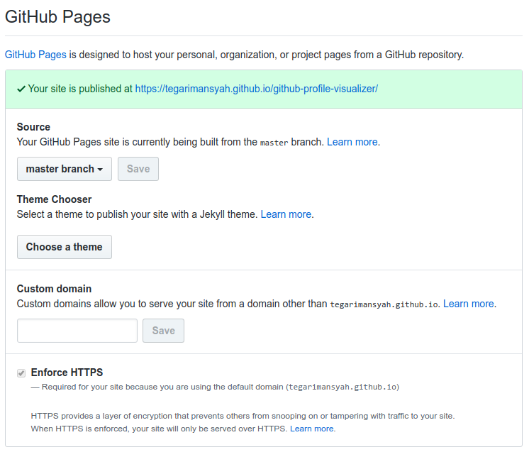
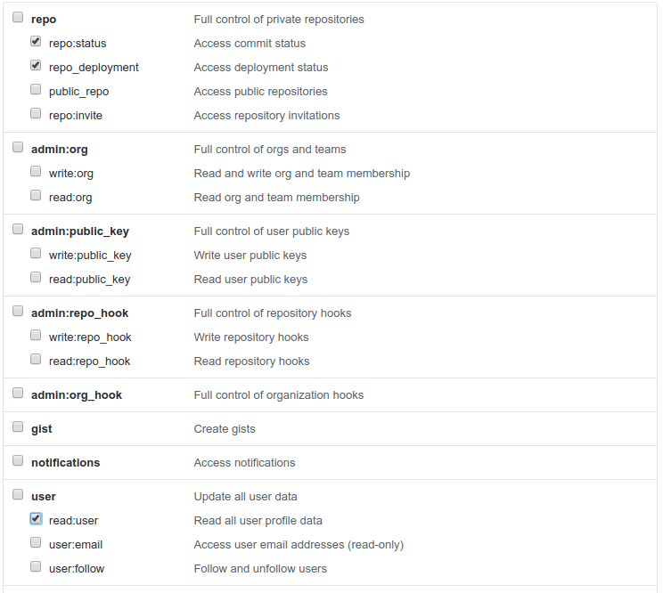

# Github Profile Visualizer

Visualize Github profile growth (followers, num repo, etc) with daily cron and Github Pages.

Available via Github Pages - [https://freedomofkeima.github.io/github-profile-visualizer/](https://freedomofkeima.github.io/github-profile-visualizer/).

## Make Your Own

* Fork this repo.
* Open your repo setting and scroll down to Github Pages. Change your `source` and save. Your setup should look like bellow.



* Clone your repo to your computer and run `sh init.sh github-username github-token`. Read bellow to get your token.
* Check if it works, visit `https://[your-username].github.io/github-profile-visualizer/`.


## Github Personal Access Token

To access Github, we need to create a personal access token.

Access [https://github.com/settings/tokens/new](https://github.com/settings/tokens/new) to generate a new personal token.


We need to set the following 3 scopes:

```
"scopes": [
	"public_repo",
	"repo:status",
	"read:user"
]
```



`public_repo` is used to allow us commiting daily cron changes back to the repository, while `repo:status` is used to get number of repositories, and `read:user` is used to get number of followers & followings.

## ok.sh

`ok.sh` is adapted from [whiteinge/ok.sh](https://github.com/whiteinge/ok.sh), which has BSD 3-Clause.

As of October 3, 2018, `ok.sh` doesn't support `list_followers` and `list_following`. Therefore, `ok.sh` in this repository is a freezed version with modifications.

You need to use "Personal Access Token" that you have retrieved above in `$HOME/.netrc`. Ensure that the permission is restricted with `chmod 600 ~/.netrc`!

```
machine api.github.com
    login <username>
    password <token>

machine uploads.github.com
    login <username>
    password <token>

# If you don't have any credentials configured on git, you need the following lines
machine github.com
    login <username>
    password <token>
```

For other optional configurations, consult to [whiteinge/ok.sh#configuration](https://github.com/whiteinge/ok.sh#configuration).

## script.sh

Assuming your repository clone is located at `$HOME`, then you can try running `script.sh` via:

```
$ GITHUB_USER=[YOUR_USERNAME] GITHUB_TOKEN=[YOUR_TOKEN] $HOME/github-profile-visualizer/script.sh
```

## Adding cron job

At this point, you should be able to see a new commit in your repository, congrats!

The next step is, we want to automate the job. You can add the following line to your crontab (`crontab -e`):

```
0 10 * * * GITHUB_USER=[YOUR_USERNAME] GITHUB_TOKEN=[YOUR_GENERATED_TOKEN] $HOME/github-profile-visualizer/script.sh &>/dev/null
```

Feel free to adjust the parameter above (schedule, source path, etc) based on your configuration.

## License

This project is licensed under BSD 3-Clause.
